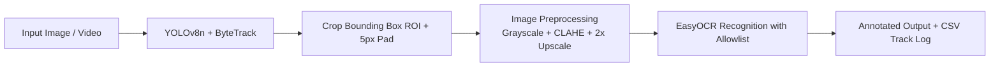

# Number Plate Detection & Tracking using Deep Learning

[](https://www.python.org/)
[](https://github.com/ultralytics/ultralytics)
[](https://gradio.app/)
[](LICENSE)

An end-to-end Automated License Plate Recognition (ALPR) and Video Tracking system built using **YOLOv8** for real-time license plate localization, **ByteTrack** for object tracking, **EasyOCR** for text recognition, and an interactive **Gradio** web application.

---

## 📷 Web Interface Demo


*(Place a screenshot of the running Gradio application at `assets/demo.png`)*

---

## ✨ Features

- **Object Detection**: High-accuracy license plate bounding box localization using fine-tuned YOLOv8n.
- **Video Tracking**: Multi-vehicle license plate tracking with ByteTrack and track ID persistence.
- **Smart OCR Scheduling**: OCR executed selectively on high-sharpness crops (up to 3 reads per track) with majority-vote aggregation.
- **ROI Preprocessing**: CLAHE contrast enhancement, 2x cubic interpolation upscaling, and uppercase alphanumeric allowlist filtering.
- **Interactive Dual-Tab Web UI**: Gradio application featuring Image Detection and Video Tracking tabs.
- **CLI Batch & Video Tools**: Dedicated CLI utilities (`detect_cli.py` & `video_cli.py`) for automated processing.

---

## ⚙️ How It Works



1. **Detection & Tracking**: Frame images are evaluated by the fine-tuned `YOLOv8n` model (`imgsz=640`) with ByteTrack persistence.
2. **Crop & Pad**: Extracted bounding box ROI is expanded by a 5px margin.
3. **Enhancement**: ROI is converted to grayscale, upscaled 2x using cubic interpolation, and enhanced via CLAHE contrast adjustment.
4. **Selective OCR**: For video tracking, OCR reads are triggered only when a sharper/larger crop appears (Laplacian variance > 30.0), aggregating reads via majority voting.
5. **Output**: Visual bounding box, track ID, confidence score, cropped ROI, and recognized text string are rendered in Gradio or saved to disk (`results/video_output.mp4` & `results/video_plates.csv`).

---

## 📊 Dataset Summary & Cleaning Pipeline

- **Source**: Kaggle License Plate Dataset (`andrewmvd/car-plate-detection`)
- **Initial Raw Images**: 433
- **Duplicate Images Removed**: 131 (MD5 checksum verification)
- **Valid Retained Samples**: 302
- **Splits (70% Train / 20% Val / 10% Test)**:
  - **Train Split**: 211 images
  - **Validation Split**: 60 images
  - **Test Split**: 31 images

---

## 📈 Performance & Results

| Dataset Split | Images / Plates | Precision | Recall | mAP @ 0.50 | mAP @ 0.50-0.95 | Inference Speed (CPU) |
|---|---|---|---|---|---|---|
| **Validation (60 images)** | 60 images / 67 plates | `0.8100` | `0.7660` | `0.7960` | `0.4430` | — |
| **Test (31 held-out images)** | 31 images / 33 plates | `0.8470` | `0.8392` | `0.8908` | `0.5146` | `111.5 ms / image` |

---

## 📹 Video Processing Pipeline

The video pipeline processes input clips using frame-skipping and selective OCR triggering for CPU speed optimization:

```bash
python video_cli.py --source videos/sample.mp4 --out results/video_output.mp4 --max-seconds 15
```

- **Output Video**: Saved to `results/video_output.mp4` with bounding boxes and track labels.
- **Track Log CSV**: Saved to `results/video_plates.csv` (`track_id`, `plate_text`, `ocr_confidence`, `first_frame`, `last_frame`).

---

## 📁 Project Structure

```
.
├── assets/
│   └── demo.png
├── docs/
│   ├── DEMO_CHECKLIST.md
│   ├── PROJECT_SUMMARY.md
│   └── VIVA_QA.md
├── results/
│   ├── predictions/
│   ├── data_cleaning_report.txt
│   ├── dataset_samples.png
│   ├── metrics.json
│   └── metrics.txt
├── test_images/
│   ├── test_1.png
│   ├── test_2.png
│   ├── test_3.png
│   ├── test_4.png
│   └── test_5.png
├── videos/
│   └── README.md
├── weights/
│   └── best.pt
├── .gitignore
├── LICENSE
├── README.md
├── requirements.txt
├── prepare_dataset.py
├── train.py
├── evaluate.py
├── detect_cli.py
├── video_cli.py
└── app.py
```

---

## 🚀 Installation & Setup

### 1. Virtual Environment Setup

```bash
python -m venv venv
# On Windows PowerShell:
.\venv\Scripts\Activate.ps1
# On Linux/macOS:
source venv/bin/activate

pip install -r requirements.txt
```

> **Note on Kaggle Authentication**: Kaggle API access is only required if running `prepare_dataset.py` to re-download raw data. Configure your credentials via environment variable `KAGGLE_CONFIG_DIR` pointing to the directory containing your personal `kaggle.json`. Do not commit credentials.

---

## 💻 Usage Instructions

### Prepare Dataset
```bash
python prepare_dataset.py
```

### Train YOLOv8 Detector
```bash
python train.py
```

### Evaluate Model on Test Set
```bash
python evaluate.py
```

### CLI Image Inference
```bash
python detect_cli.py --source test_images --out results/predictions
```

### CLI Video Tracking & OCR
```bash
python video_cli.py --source videos/sample.mp4 --max-seconds 15
```

### Launch Gradio Web App
```bash
python app.py
```
Open your browser at `http://127.0.0.1:7860`.

---

## ⚠️ Limitations

1. **Dataset Size & Scope**: Trained on 302 clean, mostly close-up vehicle images; performance may drop on small, distant plates or steep camera angles (>45 degrees). The test set has only 31 images (33 plates), so the metrics have high variance.
2. **Motion Blur & Fast Vehicles**: High-speed vehicle motion in video streams can cause severe frame blur, reducing OCR character accuracy.
3. **CPU Speed**: Processing video streams on CPU achieves 15-25 FPS with `--frame-skip 2`; dedicated GPU hardware is recommended for real-time multi-camera feeds.
4. **False Positives vs Confidence Trade-off**: The default detection confidence threshold is set to 0.4. This successfully recovers lower-contrast real plates (e.g. test_1 with 0.46 box conf) while filtering out sub-0.4 specular reflections (e.g. 0.38 conf reflection on test_5). However, strong reflections or mirror artifacts near or above 0.4 could still be detected as false positives.

---

## 🔮 Future Enhancements

- Integrate super-resolution networks (e.g. Real-ESRGAN) for degraded plate enhancement.
- Add perspective transformation (homography) to unwarp angled plates before OCR.
- Fine-tune a CRNN / TrOCR model on specific regional license plate fonts.

---

## 📜 License

Distributed under the [MIT License](LICENSE). Copyright (c) 2026 NITHESH-0010.
